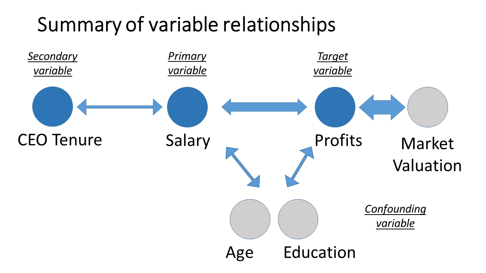

# Objective of this analysis
You are hired by a think tank that is preparing a report on CEO salary. The think tank is especially interested in whether company performance is related to salary.

# Dataset
They have collected data on a selection of companies, provided in the file ceosal_w203.RData. You are also given the following codebook:

1. salary 1990 compensation, $1000s
2. age in years
3. college =1 if attended college
4. grad =1 if attended graduate school
5. comten years with company
6. ceoten years as ceo with company
7. profits 1990 profits, millions
8. mktval market value, end 1990, mills.

# Introduction
## Definition of company performance
Our first task, then, is to define company performance. The performance of a corporate entity can be 
defined as a composite assessment of how well an organization executes on its most important parameters,
typically financial, market and shareholder performance. Key performance indicators (KPI) include 
revenue, return on investment (ROI) (or profit), overhead and operational costs. 

## Variable Identification
### Target Variable
With the current dataset we have been provided, the closest match to company performance is provided by 
the variable "profits". We therefore chose "profits" as our target variable. 

*Note*:
We briefly considered "mktval" (market value) as a candidate to measure company performance, but then 
decided the primary performance indicator is the profit of a company, as market value can be very large 
(say, for a large, publicly traded company as there are many shares outstanding), but shareholders are 
generally look to the bottom line first, then to market value. 

The exception to this is in case the company is about to go IPO or is about to be acquired - in either 
of those cases, market value is of primary interest to measure company performance. We assumed the 
companies that were part of the data set were not in either of those situations.

That being said, we did investigate "mktval" as well as a secondary target variable.

### Predictor Variable
The predictor variable is specified by the objective of this analysis to be the salary. 

# Set-up and understand the data at high level

```{r setup, include=FALSE}
knitr::opts_chunk$set(echo = TRUE)
#closeAllConnections()
#rm(list=ls())

library(car)
library(ggplot2)
library(dplyr)
library(grid)
library(gridExtra)
library(tidyr)
library(reshape2)

setwd("/Users/sohagdesai1/Berkeley/Courses/W203/W203-Lab-1/school/w203_lab1")
load("ceo_w203.RData")

# confirm CEO data is loaded
objects()
```


```{r, warning=FALSE, error=FALSE, fig.align="center", fig.width=12, fig.height=10}

nrow(CEO)
summary(CEO)
# confirmed there is no NA value in each column

# scatterplotMatrix(~ salary + age + college + grad + comten + ceoten + profits + mktval,
#                   data = CEO, diagonal = "histogram")

# removed college and grad
scatterplotMatrix(~ salary + age + comten + ceoten + profits + mktval,
                  data = CEO, diagonal = "histogram")
```

## Observations Based on Scatter Plot Matrix
* profits and mktval: strong correlation
    + We can see a strongly correlated relationship between profit and market value from the graph in position (5,6) or (6,5)
* salary and profits: mild correlation
    + We see a weaker correlation between salary and profit from the graph in position (1,5) or (5,1)
* salary and age: no correlation
    + We see very little correlation between salary and age based on the graphs in position (1,2) or (2,1)

## Univariate Analysis --- Understand Each Variable
Univariate analysis varies depending on whether the variable type is continuous or categorical. We will look at the statistical measures for categorical and continuous variables individually. For continuous variables, we need to understand the central tendency and spread of the variable. 

```{r fig.align="center", fig.width=5, fig.height=3}
# histogram
col_names <- names(CEO)
col_names <- col_names[! col_names %in% c("college", "grad")]
for (i in col_names) {
  p1 <- ggplot(CEO, aes_string(x = i)) +
    geom_histogram(bins=50)
  plot(p1)
}

```

### Observations Based on Histogram
* salary: skewed to the right
    + We see a long tail towards the right of the salary histogram - this indicates the the bulk of the values are in the lower end of the range with a few outliers to the right.
    + Salary is a continuous variable with the following central tendencies and standard deviation:
```{r , warning=FALSE, error=FALSE, fig.align="center", fig.width=12, fig.height=10}
summary(CEO$salary)
sd(CEO$salary)
```
* age: close to normal distribution
    + In contrast, the age distribution is more like a normal distribution.
    + Age is a continuous variable with the following central tendencies and standard deviation: 
```{r , warning=FALSE, error=FALSE, fig.align="center", fig.width=12, fig.height=10}
summary(CEO$age)
sd(CEO$age)
```
* college/grad: need different visualization
    + Based on the summary above we see that college and grad are categorical variables
    + The vast majority of employees have attended college (>160)
    + A large number of employees have attended grad school (>100)
```{r , warning=FALSE, error=FALSE, fig.align="center", fig.width=5, fig.height=3}
p1 <- ggplot(CEO, aes_string(x = CEO$college)) +
    geom_histogram(bins=50)
plot(p1)

p2 <- ggplot(CEO, aes_string(x = CEO$grad)) +
    geom_histogram(bins=50)
plot(p2)
```
    
* comten(years with company): distributed
    + Company tenure is more like a uniform distribution, although there are two spikes indicating a large number of employees with a short tenure of less than two years and a long tenure of 35 years or so
    + Company tenure is a continuous variable with the following central tendencies and standard deviation: 
```{r , warning=FALSE, error=FALSE, fig.align="center", fig.width=12, fig.height=10}
summary(CEO$comten)
sd(CEO$comten)
```
* ceoten(years as CEO with company): skewed to the right
    + CEO tenure is skewed to the right with a long tail. The bulk of the CEOs have a tenure less than 10 years, but there are outliers with over 30 years of tenure
    + CEO tenure is a continuous variable with the following central tendencies and standard deviation: 
```{r , warning=FALSE, error=FALSE, fig.align="center", fig.width=12, fig.height=10}
summary(CEO$ceoten)
sd(CEO$ceoten)
```

* profits(1990 profits, millions): skewed to the right
    + Profits is skewed to the right with a long tail. The bulk of the profits are clustered in a region less than $100M, but there are outliers with over $1B of profits including one company with well over $2B
    + Profits is a continuous variable with the following central tendencies and spread: 
```{r , warning=FALSE, error=FALSE, fig.align="center", fig.width=12, fig.height=10}
summary(CEO$profits)
sd(CEO$profits)
```

* mktval(market value, end 1990, mills.): skewed to the right
    + Market value is skewed to the right with a long tail. The bulk of the market value are clustered in a region less than $5B, but there are outliers with over $20B of market value including one company with well over $40B
    + Market value is a continuous variable with the following central tendencies and standard deviation: 
```{r , warning=FALSE, error=FALSE, fig.align="center", fig.width=12, fig.height=10}
summary(CEO$mktval)
(CEO$mktval)
```


## Observations based on Univariate Analysis

* salary: outliers in between 2000K - 6000K - maybe we should investigate them further.
* age: outliers below 40 and above 70
* ceoten: outliers above 25
* profits: outliers below -$450M and above $1B
* mktval: outliers above $45B

Given the data is very small (only 185 rows), we should be cautious in treating outliers to uncover correlations and others.

## Bivariate Analysis --- Identifying Primary Variables
Bivariate Analysis finds out the relationship between two variables. We look for association and disassociation between variables at a pre-defined significance level. We can perform bivariate analysis for any combination of categorical and continuous variables. 

```{r fig.align="center"}

col_names <- names(CEO)
col_names <- col_names[! col_names %in% c("college", "grad", "profits")]

for (i in col_names) {
  plt1 <-  ggplot(CEO, aes_string(x = i, y = "profits")) +
  geom_point() +
  geom_smooth(method = lm) ## Add linear regression line with by default 95% confidence region
  plot(plt1)
}

# refer http://www.cookbook-r.com/Graphs/Scatterplots_(ggplot2)/ for geom_smooth

```

## Investigate relationship between salary and profits --- assess impact of outliers

```{r fig.align="center", fig.width=10, fig.height=4, warning=FALSE}
# plot
p1 <- ggplot(CEO, aes(x= salary, y = profits)) +
  geom_point() +
  geom_smooth(method = lm) +
  ggtitle("with") +
  theme(plot.title = element_text(hjust = 0.5, size=14)) +
  scale_x_continuous(limits = c(0, 5500)) +
  scale_y_continuous(limits = c(-500, 3000))

# plot without two outliers
df <- CEO %>% filter(salary < 4000 & profits < 2000)
p2 <- ggplot(df, aes(x= salary, y = profits)) +
  geom_point() +
  geom_smooth(method = lm) +
  ggtitle("without") +
  theme(plot.title = element_text(hjust = 0.5, size=14)) +
  scale_x_continuous(limits = c(0, 5500)) +
  scale_y_continuous(limits = c(-500, 3000))

grid.arrange(p1, p2, ncol = 2, nrow = 1,
             top = textGrob("with/without outliers", 
                            gp=gpar(fontsize=18)))

```

```{r}
# check outliers
CEO %>% filter(salary > 4000)
CEO %>% filter(profits > 2000)

```
We see very little impact from removing the two outliers. The correlation between salary and profits is nearly unchanged. This can be explained by the fact that these two outliers counterbalance each other - one is an outlier which is a high profit for the salary, and the other is an outlier with a high salary for the profit. 

## Investigate relationship between salary and profits --- look for confounding variables

```{r fig.align="center", fig.width=13, fig.height=11, warning=FALSE}

### Data preparation ------------------------------------------------------------------------------------

# binning for education
CEO$education[CEO$college == 0] <- "Less than college"
CEO$education[CEO$college == 1] <- "College"
CEO$education[CEO$grad == 1] <- "Grad"

# Among 185 samples, less than college 5, college 78, grad 102

CEO$education <- factor(CEO$education, levels=c("Less than college", "College", "Grad"))

# binning for age
CEO$agegroup[CEO$age <= 45] <- "Under 45"
CEO$agegroup[CEO$age > 45 & CEO$age <= 60] <- "45 to 60"
CEO$agegroup[CEO$age > 60] <- "Over 60"

CEO$agegroup <- factor(CEO$agegroup, levels=c("Under 45", "45 to 60", "Over 60"))

# age distribution
#   Min. 1st Qu.  Median    Mean 3rd Qu.    Max. 
#   21.00   51.00   57.00   55.78   61.00   86.00 

#binning for CEO tenure
CEO$ceoten_group[CEO$ceoten <= 3] <- "Less than 3"
CEO$ceoten_group[CEO$ceoten <= 5 & CEO$ceoten > 3] <- "3 to 5"
CEO$ceoten_group[CEO$ceoten <= 11 & CEO$ceoten > 5] <- "5 to 11"
CEO$ceoten_group[CEO$ceoten > 11] <- "More than 11"

CEO$ceoten_group <- factor(CEO$ceoten_group, levels=c("Less than 3", "3 to 5", 
                                                      "5 to 11", "More than 11"))

# CEO tenure distribution
#   Min. 1st Qu.  Median    Mean 3rd Qu.    Max. 
#  0.000   3.000   5.000   7.681  11.000  37.000 

#binning for years with companies
CEO$comten_group[CEO$comten <= 9] <- "Less than 9"
CEO$comten_group[CEO$comten <= 21 & CEO$comten > 9] <- "9 to 21"
CEO$comten_group[CEO$comten <= 33 & CEO$comten > 21] <- "21 to 33"
CEO$comten_group[CEO$comten > 33] <- "More than 33"

CEO$comten_group <- factor(CEO$comten_group, levels=c("Less than 9", "9 to 21", 
                                                      "21 to 33", "More than 33"))

#   Min. 1st Qu.  Median    Mean 3rd Qu.    Max. 
#   2.00    9.00   21.00   21.66   33.00   58.00 

### Plotting -------------------------------------------------------------------------------------------

# by education
p1 <- ggplot(CEO, aes(x= salary, y = profits, colour = education)) +
  geom_point() +
  scale_x_continuous(limits = c(0, 3000)) +   # this excludes outlier from the plot but not from calculation for linear regression
  ggtitle("by education") +
  theme(legend.position="top") +
  theme(plot.title = element_text(hjust = 0.5, size=14)) +
  geom_smooth(method = lm,                    # Add linear regression line for each bin
              se=FALSE) +                     # don't add shaded confidence region
  geom_smooth(method = lm, formula = y~x,     # Add linear regression line for total data
              se=FALSE, color = 'black', linetype = 'dashed')
# by agegroup
p2 <- ggplot(CEO, aes(x= salary, y = profits, colour = agegroup)) +
  geom_point() +
  scale_x_continuous(limits = c(0, 3000)) +   # this excludes outlier from the plot but not from calculation for linear regression
  ggtitle("by age group") +
  theme(legend.position="top") +
  theme(plot.title = element_text(hjust = 0.5, size=14)) +
  geom_smooth(method = lm,                    # Add linear regression line for each bin
              se=FALSE) +                     # don't add shaded confidence region
  geom_smooth(method = lm, formula = y~x,     # Add linear regression line for total data
              se=FALSE, color = 'black', linetype = 'dashed')

# by ceo tenure
p3 <- ggplot(CEO, aes(x= salary, y = profits, colour = ceoten_group)) +
  geom_point() +
  scale_x_continuous(limits = c(0, 3000)) +   # this excludes outlier from the plot but not from calculation for linear regression
  ggtitle("by CEO tenure") +
  theme(legend.position="top") +
  theme(plot.title = element_text(hjust = 0.5, size=14)) +
  geom_smooth(method = lm,                    # Add linear regression line for each bin
              se=FALSE) +                     # don't add shaded confidence region
  geom_smooth(method = lm, formula = y~x,     # Add linear regression line for total data
              se=FALSE, color = 'black', linetype = 'dashed')

# by years with a company
p4 <- ggplot(CEO, aes(x= salary, y = profits, colour = comten_group)) +
  geom_point() +
  scale_x_continuous(limits = c(0, 3000)) +   # this excludes outlier from the plot but not from calculation for linear regression
  ggtitle("by years with a compnay") +
  theme(legend.position="top") +
  theme(plot.title = element_text(hjust = 0.5, size=14)) +
  geom_smooth(method = lm,                    # Add linear regression line
              se=FALSE) +                     # don't add shaded confidence region
  geom_smooth(method = lm, formula = y~x,     # Add linear regression line for total data
              se=FALSE, color = 'black', linetype = 'dashed')

grid.arrange(p1, p2, p3, p4, ncol = 2, nrow = 2,
             top = textGrob("Confounding Variables", 
                            gp=gpar(fontsize=18)))

```

### Bivariate analysis of salary v/s profit by education
* We see that the regression lines for profit v/s salary if the employee has a college or graduate degree tracks closely with the regression line for the overall profit v/s salary data set
* For less than college education there is no correlation, however, there are only four data points corresponding to less than college education
* This implies that education could be a confounding variable when predicting profit

### Bivariate analysis of salary v/s profit by age group
* Once again we see that the regression lines for profit v/s salary based on the age group tracks closely with the regression line for the overall profit v/s salary data set when the employee age is over 45
* For under 45, there appears to be not much of a correlation; however there are relatively few employees below the age of 45 
* This implies that age group could be a confounding variable when predicting profit

### Bivariate analysis of salary v/s profit by CEO tenure
* We see that the regression lines for profit v/s salary based on CEO tenure tracks closely with the regression line for the overall profit v/s salary data set
* This implies that CEO tenure could be a confounding variable when predicting profit

### Bivariate analysis of salary v/s profit by company tenure
* We see that the regression lines for profit v/s salary based on company tenure tracks closely with the regression line for the overall profit v/s salary data set
* This implies that company tenure could be a confounding variable when predicting profit


# Bivariate analysis --- Identifying secondary variable

```{r fig.align="center", fig.width=5, fig.height=3}

col_names <- names(CEO)
col_names <- col_names[! col_names %in% c("profits", "salary", "mktval", "college", "grad")]

# for (i in col_names) {
#   plt1 <-  ggplot(CEO, aes_string(x = i, y = "salary")) +
#   geom_jitter() +
#   geom_smooth(method = lm) ## Add linear regression line with by deafult 95% confidence region
#   plot(plt1)
# }

# excdlude one outlier
CEO_WO <- CEO %>% filter (salary < 4000)

for (i in col_names) {
  plt1 <-  ggplot(CEO_WO, aes_string(x = i, y = "salary")) +
  geom_jitter() +
  geom_smooth(method = lm) ## Add linear regression line with by deafult 95% confidence region
  plot(plt1)
}

```


## Exploration of secondary variables --- CEO tenure vs. salary

```{r fig.align="center", fig.width=13, fig.height=12, warning=FALSE}

# by education
p1 <- ggplot(CEO_WO, aes(x= ceoten, y = salary, colour = education)) +
  geom_point() +
  ggtitle("by eduation") +
  theme(legend.position="top") +
  theme(plot.title = element_text(hjust = 0.5, size=14)) +
  geom_smooth(method = lm, # Add linear regression line
              se=FALSE)         # don't add shaded confidence region

# by CEO tenure
p2 <- ggplot(CEO_WO, aes(x= ceoten, y = salary, colour = agegroup)) +
  geom_point() +
  ggtitle("by age group") +
  theme(legend.position="top") +
  theme(plot.title = element_text(hjust = 0.5, size=14)) +
  geom_smooth(method = lm, # Add linear regression line
              se=FALSE)         # don't add shaded confidence region

# by years with a company
p3 <- ggplot(CEO_WO, aes(x= ceoten, y = salary, colour = comten_group)) +
  geom_point() +
  ggtitle("by years with a compnay") +
  theme(legend.position="top") +
  theme(plot.title = element_text(hjust = 0.5, size=14)) +
  geom_smooth(method = lm, # Add linear regression line
              se=FALSE)         # don't add shaded confidence region

grid.arrange(p1, p2, p3, ncol = 2, nrow = 2,
             top = textGrob("CEO tenure vs. salary", 
                            gp=gpar(fontsize=18)))

```

## Exploration of secondary variables --- age vs. salary --- don't show this

```{r fig.align="center", fig.width=13, fig.height=12, warning=FALSE}

# by education
p1 <- ggplot(CEO_WO, aes(x= age, y = salary, colour = education)) +
  geom_point() +
  ggtitle("by eduation") +
  theme(legend.position="top") +
  theme(plot.title = element_text(hjust = 0.5, size=14)) +
  geom_smooth(method = lm, # Add linear regression line
              se=FALSE)         # don't add shaded confidence region

# by CEO tenure
p2 <- ggplot(CEO_WO, aes(x= age, y = salary, colour = ceoten_group)) +
  geom_point() +
  ggtitle("by CEO tenure") +
  theme(legend.position="top") +
  theme(plot.title = element_text(hjust = 0.5, size=14)) +
  geom_smooth(method = lm, # Add linear regression line
              se=FALSE)         # don't add shaded confidence region

# by years with a company
p3 <- ggplot(CEO_WO, aes(x= age, y = salary, colour = comten_group)) +
  geom_point() +
  ggtitle("by years with a compnay") +
  theme(legend.position="top") +
  theme(plot.title = element_text(hjust = 0.5, size=14)) +
  geom_smooth(method = lm, # Add linear regression line
              se=FALSE)         # don't add shaded confidence region

grid.arrange(p1, p2, p3, ncol = 2, nrow = 2,
             top = textGrob("Age vs. salary", 
                            gp=gpar(fontsize=18)))

```

# Conclusion


